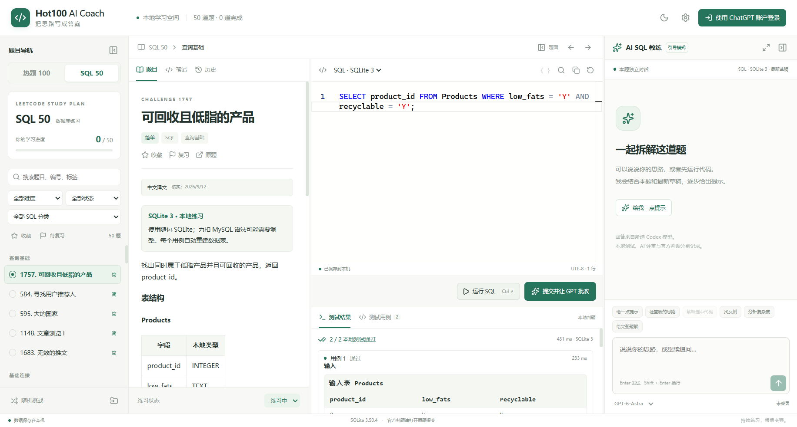
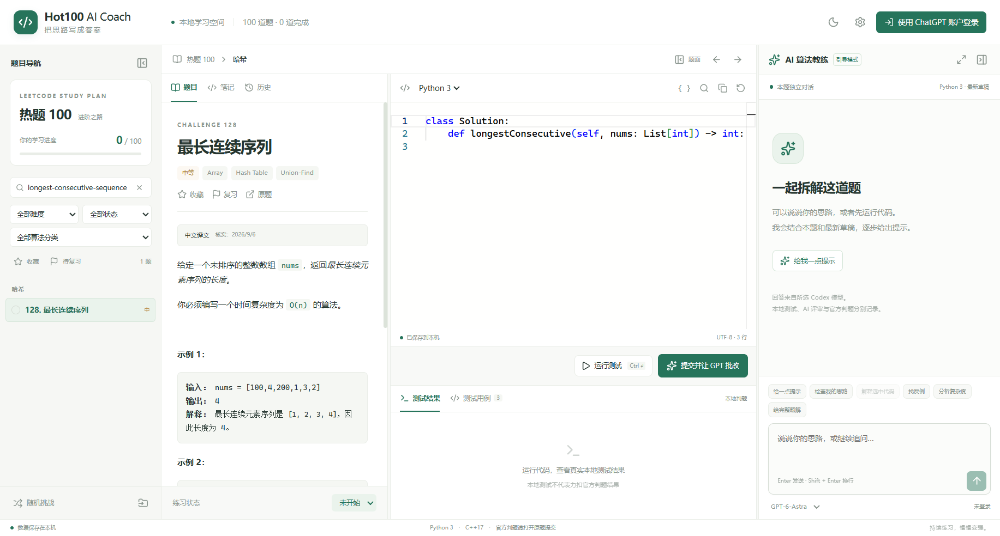

# Hot100 AI Coach

[下载 Windows 安装包](https://github.com/hukai2021/leetcode-100-with-AI/releases/download/v0.2.0/Hot100-AI-Coach-Setup-0.2.0-x64.exe) · [版本与附件](https://github.com/hukai2021/leetcode-100-with-AI/releases/tag/v0.2.0) · [验收摘要](docs/ACCEPTANCE.md)

Windows 10/11 x64 桌面刷题软件：本地题库、Python 3 / C++17 编辑与真实运行、通过官方 Codex App Server 使用 ChatGPT 账户批改代码，以及每题独立的右侧辅导对话。

已在 Windows Electron 窗口完成真实账户识别、算法代码批改、连续追问、修正代码测试、关闭重启恢复，并在重启后继续同一官方对话。准确验收范围和证据见 [验收记录](docs/ACCEPTANCE.md)。

**0.2.0 新增独立 SQL 50 题单。** 左侧点击「热题 100 / SQL 50」切换，分别统计进度并保存每题学习记录。原 Hot100 题库、Python/C++ 模板与算法运行器保留。安装包为 `release/Hot100-AI-Coach-Setup-0.2.0-x64.exe`（357,629,693 字节，约 341 MiB），安装后可双击桌面「Hot100 AI Coach」启动。

安装包未做数字签名；Windows 可能显示未知发布者。本次已在 Windows 10 x64 实机安装运行，Windows 11 干净机器和多显示器环境尚未逐一验证。



SQL 50 的 50 题 / 103 个本地用例、真实 ChatGPT SQL 批改和右侧连续追问均已完成验证。原 Hot100 Python/C++、格式化与保存流程回归通过；详见 [SQL50 实测摘要](docs/sql50-validation.json)。



## 安装与首次登录

取得已完成验证的安装包后，双击安装，选择目录并保留桌面快捷方式。日常双击「Hot100 AI Coach」启动，无需打开终端、浏览器或开发服务器。完整安装包包含 Python、C++ 编译器、格式化工具和官方 Codex 程序；只有 AI 请求和首次授权需要联网。

1. 在软件右上角点击「使用 ChatGPT 账户登录」。
2. 系统浏览器将打开官方授权页。登录你要使用的 ChatGPT 账户，按页面提示允许 Codex 访问。
3. 返回软件，等待账户显示更新。若未更新，打开「设置与数据」，点击「刷新账户与模型」。授权窗口可取消后重新打开。
4. 在右侧聊天底部选择服务实际返回的模型，再进行批改或追问。设置页显示实际账户、套餐和可获得的额度原始信息。

账户接入使用官方 Codex App Server 的 stdio 协议。登录与凭据刷新交给官方认证组件，应用使用单独的 Codex 数据目录及 Windows 凭据存储，不改写已有全局 Codex 配置。不要把登录链接、凭据目录或系统凭据导出给别人。

这里使用的是账户可用的 **Codex 权限、模型和额度**，不保证继承 ChatGPT 网页全部模型、记忆或现有聊天记录。验收中实际服务返回并使用过 `gpt-6-astra`；软件的模型列表动态读取，不把这个测试值写死为可用模型。

如果额度用尽、授权过期或网络失败，界面会展示实际错误；本地浏览、编辑和测试仍可用。额度不足时等待账户额度恢复；授权失效时可在设置中退出并重新登录。当前版本没有 API Key 备用入口，也不会自动切换到另行付费服务。

## 完成一题

1. 左侧搜索题号、题名或标签，按难度、分类、状态筛选，也可只看收藏/待复习题。支持上一题、下一题和随机题。
2. 阅读题目、示例及约束，选择 Python 3 或 C++17，在编辑区填写 `Solution` 方法或设计题类。无需自己写输入输出或 `main()`。
3. 点击「运行测试」，或按 `Ctrl+Enter`，查看输入、预期、实际值、通过数、标准输出和错误。
4. 点击「提交并让 GPT 批改」，或按 `Ctrl+Shift+Enter`。软件先真实运行，再发送本次代码快照、题面和实际结果。批改保存在对应提交中，后续修改草稿不会改变旧批改的对象。
5. 在右侧继续追问。可选中代码后点击「解释选中代码」，也可使用提示、找反例或复杂度等快捷操作。默认逐步引导；希望直接获得解法时点击「给完整题解」。
6. AI 回答中的代码建议可先「比较代码建议」，确认差异后再应用。应用、格式化和重置前都会保留可恢复版本，应用后请重新测试。
7. 在「笔记」记录思路，按需要标记收藏、复习和完成状态。完成状态由你手动维护，不代表力扣官方 AC。

聊天支持流式回答、停止、重试、折叠、拖动宽度和独立弹出窗口；切题切换本题对话。`Enter` 发送，`Shift+Enter` 换行。代码编辑支持行号、高亮、缩进、撤销重做、基础补全、查找替换和真实格式化；没有另行接入 Python/C++ 语言服务器，不能等同完整 IDE 的类型补全与静态诊断。

`Ctrl+S` 保存，`Ctrl+F` 查找，`Ctrl+H` 替换，`Ctrl+Z` 撤销。主题和字体大小在设置中调整。

## 练习力扣 SQL 50

在左侧题库选择器切换到「SQL 50」。软件按力扣官方 [SQL 50 学习计划](https://leetcode.com/studyplan/top-sql-50/) 收录 50 题，提供中文题意、表结构、输入数据和预期结果。热题 100 与 SQL 50 分别统计进度，每题的草稿、笔记、收藏、提交和聊天独立保存。

1. 选择一道 SQL 题，阅读表结构和示例。编辑器会自动切换到 SQL。
2. 编写单条 SQLite 查询（可使用 WITH、JOIN、聚合和窗口函数），点击「运行 SQL」或按 Ctrl+Enter。测试库已建表并装入数据，无需自行 CREATE TABLE 或 INSERT。
3. 在结果中对照预期与实际表格。判题检查列名、值和重复次数；题目要求排序时也检查行顺序。NULL 与空字符串分别显示。
4. 点击「提交并让 GPT 批改」，查看基于本次 SQL 和实际测试结果的点评，再在右侧继续追问。请在本地验证 AI 建议后自行标记完成。
5. 第 196 题使用单条 DELETE 删除 Person 表的重复数据；测试比较删除后剩余的整张表。每个用例都从原始数据重新建立内存库，重复运行不会污染后续测试。

本地运行的是随包 **SQLite 3**，力扣原题常用 MySQL。题面提供适用的方言提示；例如日期计算可使用 date/julianday/strftime，字符串拼接用 ||，整数相除计算比例时应转为浮点。SQLite 未内建 MySQL 的 DATE_FORMAT、DATEDIFF 或 REGEXP，不能直接运行所有 MySQL 答案。软件保留官方原题链接，提交前请按力扣选择的数据库方言调整。更多见 [SQL50 题库说明](docs/SQL50.md) 和 [SQLite 日期函数文档](https://www.sqlite.org/lang_datefunc.html)。

SQL 暂不提供自动格式化。每例限制 3 秒、256 MiB，结果最多 1000 行 / 128 KiB；只允许访问本例的内存表，禁止附加数据库、加载扩展及其他写入。自定义用例的 input 为一个包含表数据对象的数组，列顺序以题目表结构为准：

```json
[
  {
    "input": [{"Products": [[1, "Y", "Y"], [2, "Y", "N"]]}],
    "expected": {"columns": ["product_id"], "rows": [[1]]},
    "source": "自行核验"
  }
]
```

## 题库与本地判题范围

Hot 100 题单缓存为官方 Hot 100 的 **100 题中文题面、247 个官方题面样例、两种语言模板**。其中 2 题为官方中文正文，98 题依据项目已缓存的官方英文原文逐题翻译并交叉核对，在界面标记为「中文译文」，来源详情保留原文链接。原始英文缓存仍随源码保存。69 个图示来源均已缓存，42 题中的 73 个图片元素已内嵌；变量、公式、示例数据、代码模板及判题用例保持不变。

Python 本地参考实现已通过全部 100 题的 247 个样例。C++ 已完成全部 100 题官方模板的编译与调用适配验证，另有代表性题型的真实算法测试；这不等于已经对全部 100 题 C++ 算法做过正确性验证。详见 [运行器与测试说明](docs/RUNNER.md)。

**本地测试通过、AI 推理结论、力扣官方判题是三件不同的事。** 本项目没有隐藏测试结果、官方执行排名或官方 AC。当前支持打开力扣原题和复制代码；没有实现力扣账户同步、自动提交或官方成绩同步。

运行器有独立临时目录、环境变量白名单、超时、输出上限、Windows Job Object 内存及进程树管理，**不是安全沙箱**。用户代码仍有当前 Windows 用户的文件与网络权限，请运行自己编写或信任的代码。默认每例 3 秒、256 MiB 内存，标准输出和错误合计 256 KiB；停止按钮可以结束运行任务。C++ 标准容器启用了部分越界断言，没有通用内存安全保证。

## 自定义测试与导入题目

「测试用例」页勾选「使用自定义用例（本次运行）」，输入 JSON 数组。例如两数之和：

```json
[
  {"input": [[2, 7, 11, 15], 9], "expected": [0, 1], "source": "自行核验"},
  {"input": [[3, 3], 6], "expected": [0, 1], "source": "自行核验"}
]
```

`input` 是**函数参数组成的数组**，`expected` 是预期结果；每个用例必须包含二者。一次 1～100 例。自定义预期由提供者核验，不会被标记为官方答案。

| 特殊题型 | 输入/预期格式 |
| --- | --- |
| 普通链表 | 单个参数使用值数组，如 `[[1,2,3]]`；返回链表也是值数组 |
| 二叉树 | 参数使用层序数组，缺节点写 `null`，如 `[[1,null,2,3]]` |
| 环形链表 | `input: [[3,2,0,-4],1]`；题 141 预期布尔，题 142 预期入口索引，无环为 `-1` |
| 相交链表 | `[intersectVal,listA,listB,skipA,skipB]`；预期交点值，无交点为 `null` |
| LCA | `[层序数组,p的值,q的值]`；预期最近公共祖先的值 |
| 随机指针链表 | 单参数为 `[[值,random索引或null],...]`；整体 `input` 再包一层参数数组 |
| 设计题 | `[操作名数组,各操作参数数组]`；首项是构造类名，预期数组中构造及 void 操作用 `null` |
| 原地修改 | `expected` 填修改后的首个参数 |

在「设置与数据 → 导入题库」选择 UTF-8 `.json` 或 `.md` 文件。一次最多 1000 题、文件不超过 20 MB。同 `id` 覆盖该题缓存；不同 `id` 新增题目。JSON 可为单个对象、题目对象数组，或 `{"problems":[...]}`。使用如下完整结构：

```json
{
  "id": "practice-two-sum",
  "title": "两数之和练习",
  "slug": "two-sum",
  "difficulty": "Easy",
  "category": "哈希",
  "tags": ["数组", "哈希表"],
  "url": "https://leetcode.cn/problems/two-sum/",
  "contentFormat": "markdown",
  "content": "给定数组 nums 和 target，返回两个不同位置，使元素之和为 target。",
  "templates": {
    "python": "class Solution:\n    def twoSum(self, nums: List[int], target: int) -> List[int]:\n        pass\n",
    "cpp": "class Solution { public: vector<int> twoSum(vector<int>& nums, int target) { return {}; } };"
  },
  "meta": {
    "name": "twoSum",
    "params": [{"name": "nums", "type": "integer[]"}, {"name": "target", "type": "integer"}],
    "return": {"type": "integer[]"}
  },
  "source": {"url": "个人练习说明", "verifiedAt": "2026-09-07", "contentLanguage": "zh-CN"},
  "cases": [{"input": [[3,3],6], "expected": [0,1], "source": "手工核验：0、1为两个不同位置"}]
}
```

`id` 必须是 1～80 位字符串，只使用字母、数字、下划线或短横线；保留准确的 `slug` 以启用特殊比较器。`templates` 须有 `python`、`cpp`；`meta` 必须与真实方法签名匹配。`url` 若填写，只接受 `leetcode.cn` 或 `leetcode.com` 的 HTTPS 原题链接。`contentFormat` 可为 `html` 或 `markdown`。

Markdown 文件的开头必须是 **JSON 元数据，不是 YAML**：把元数据 JSON 放在两个 `---` 之间，第二个分隔符下一行开始写正文。下面可直接保存为 `整数加法.md` 并导入：

```markdown
---
{
  "id": "import-add",
  "title": "整数加法练习",
  "slug": "integer-addition",
  "difficulty": "Easy",
  "category": "基础",
  "tags": ["自编练习"],
  "templates": {
    "python": "class Solution:\n    def add(self, a: int, b: int) -> int:\n        pass\n",
    "cpp": "class Solution { public: int add(int a, int b) { return 0; } };"
  },
  "meta": {"name":"add","params":[{"name":"a","type":"integer"},{"name":"b","type":"integer"}],"return":{"type":"integer"}},
  "source": {"url":"自编练习","contentLanguage":"zh-CN","verifiedAt":"2026-09-07"},
  "cases": [{"input":[2,3],"expected":5,"source":"手算核验"}]
}
---
# 题目说明
返回两个整数 a、b 的和，输入满足 -100 ≤ a,b ≤ 100。
例如 a=2、b=3，返回 5。
```

导入官方题面时，也可以复制现有 [题库 JSON](data/problems.json) 中某题，保留方法签名及模板后更换正文。

## 保存、历史与备份

草稿按「题目 × 语言」分别自动保存。题目页的「历史」可查看提交代码、真实测试、AI 批改和可恢复版本；「笔记」、收藏、复习、完成状态也在本机保存。

正常数据目录是 `%APPDATA%\Hot100 AI Coach`：学习记录存于 `learning\coach.sqlite`，官方对话工作数据在独立 `codex` 目录。不要用清理临时文件的方式删除整个用户数据目录。

「设置与数据 → 导出备份」生成学习 JSON；导入前软件会在 `learning` 目录保留一份 `before-import-时间戳.json`。导入合并记录，同一键以导入值覆盖，不会主动删除其他记录。备份包含草稿、笔记、提交、对话文本、版本、设置及导入题库，不包含登录凭据或官方服务端线程映射。换机导入后可阅读历史，但需要重新登录并建立新的服务端对话上下文。

## 从源码构建

已验证开发环境为 Windows x64、Node.js **24.19.0**。建议使用 Node 24，最低需要 Node 22.12。依赖版本锁在 `package-lock.json`。以下命令在项目根目录运行：

```powershell
npm ci
# 若源码中没有完整运行依赖，先准备 Python/C++ 和 Job Object 启动器
powershell -NoProfile -ExecutionPolicy Bypass -File scripts/runner-setup.ps1
# 若没有 runtime/formatters，使用有 pip 的开发用 Python 安装（安装后日常无需该 Python）
python -m pip install --index-url https://pypi.org/simple --target runtime/formatters autopep8==2.3.2 pycodestyle==2.14.0 clang-format==23.1.0

powershell -NoProfile -ExecutionPolicy Bypass -File scripts/build.ps1
npm start
# 构建 Windows NSIS 安装包
powershell -NoProfile -ExecutionPolicy Bypass -File scripts/build.ps1 -Package
```

`build.ps1` 检查 TypeScript、构建本地界面、准备官方 Codex Windows 程序；`-Package` 继续调用 Electron Builder。输出目录是 `release`。没有必要单独启动 Vite 才能使用桌面软件。首次安装开发依赖和下载运行包需要联网，已安装应用的本地功能不依赖网络。

验证命令：

```powershell
npm test
node tests/runner-smoke.cjs
node tests/runner-format.cjs
node tests/runner-catalog-cpp.cjs
node scripts/catalog-verify.cjs
node tests/desktop-offline.cjs
# 需要已登录；会发起真实 AI 请求并消耗账户 Codex 额度
node tests/desktop-flow.cjs
```

受限 Codex shell 的 Node 路径检查可加 `--preserve-symlinks --preserve-symlinks-main`；原生 clang-format 需要正常 Windows 进程权限。普通终端及安装后的桌面应用不应套用开发工具的沙箱限制。

| 源码目录 | 内容 |
| --- | --- |
| `src` | React、Monaco、题目/聊天/历史/设置界面 |
| `electron/main.cjs`、`preload.cjs` | Windows 窗口、受限 IPC、导入导出 |
| `electron/service.cjs`、`codex.cjs` | 题目会话、提交快照、官方 App Server stdio |
| `electron/store.cjs` | SQLite 持久化及备份 |
| `electron/runner*.cjs` | Python/C++ 适配、真实执行与比较 |
| `data` | 官方题库、样例和来源记录 |
| `runtime` | 随包运行依赖、许可、SHA256 清单 |
| `scripts`、`tests` | 构建、采集、参考实现及实际测试 |
| `docs` | 使用边界、公开验收摘要、算法测试JSON和无账户信息的界面截图 |

上游题目及运行依赖保留各自权利和许可。GCC 等依赖对应的完整上游源码压缩包作为单独附件保存在 `runtime/downloads/w64devkit-source-v2.9.1.tar`，不装入日常安装包；[Release](https://github.com/hukai2021/leetcode-100-with-AI/releases/tag/v0.2.0) 提供该源码附件及许可。
