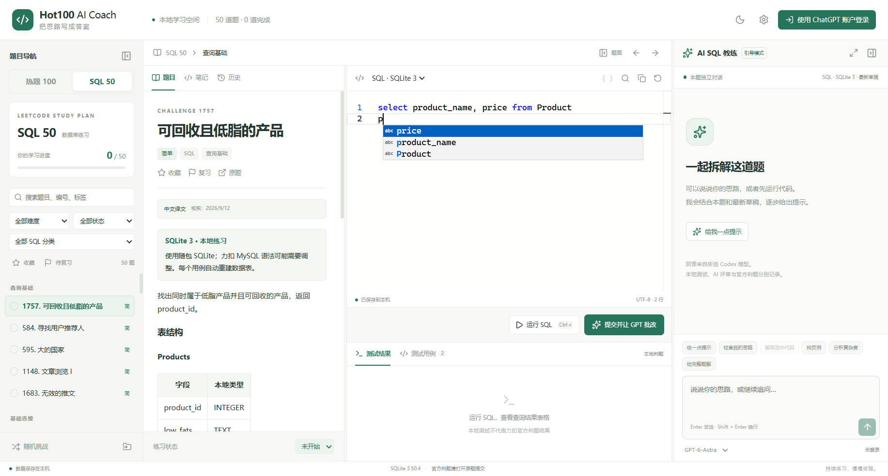

# 验收记录

## 0.4.0：SQL 50 默认使用真实 MySQL（2026-10-04）

SQL 50 默认切换到随包官方 MySQL 8.4.11，支持本题单常见 MySQL 函数和查询；保留 SQLite 3 兼容选择。旧 SQL 草稿、笔记、收藏与进度原样保留，切换引擎不会自动转换语法。Hot100 与 SQL50 仍是可切换的独立题单；原 Hot100 题库、样例、Python/C++ 模板和算法运行器保持，模型刷新与思考强度继续按下文 0.3.0 设计工作。

| 检查 | 本次实际结果 |
| --- | --- |
| 实际数据库引擎 | 官方 MySQL 8.4.11；应用私有实例仅监听本机随机端口，不安装 Windows 系统服务；首次启动需要短暂初始化 |
| MySQL 全 SQL50 本地参考解 | 50/50 题、103/103 例通过：53 个公开示例与 50 个独立编写边界例；7 类错解被识别 |
| SQLite 兼容回归 | SQLite 3.50.4，50/50 题、103/103 例通过；原参考解、题面字段和旧草稿保留 |
| Node 测试 | 54/54 通过、0 失败/跳过，包含两种 SQL 引擎、服务/存储、模型分页与强度、取消和提交快照 |
| MySQL 运行器专项 | 7 项通过：日期/正则/Unicode/NULL、权限限制、单语句与结果上限、每例重建、停止/超时、异常恢复、应用退出后进程回收 |
| 删除题数据隔离 | 第 196 题错误 DELETE 返回空结果并被判错，随后正确解 2/2，再次运行也通过；前次删除不污染下例 |
| 真实 Electron UI | 14 项通过，真实执行 MySQL 与 SQLite；AI 传输为模拟，验证题面/补全/结果、主窗口和独立聊天方言同步、快照及重启兼容，不计为真实 AI |
| 补全显示专项 | SQL / Python / C++ × 浅色 / 深色，共 6 组通过，首字母显示候选文字且键盘接受可用；MySQL 桌面专项另验证函数与字段补全 |
| 真实 AI 完整流程 | 7 项检查通过、3 轮真实请求。GPT-6.1-Sol/high 对第 197 题 julianday 错解（MySQL 0/2）完成中文批改，明确 DATEDIFF；medium 右侧追问完成 |
| 修正与保存 | 改用 DATEDIFF 后真实 MySQL 2/2；保存笔记、正解草稿与完成状态；重启后恢复旧提交代码/测试/批改、对话和可恢复错解版本 |
| 重启续问 | 重启后正解再运行仍 2/2，官方 thread/resume 恢复同一线程，GPT-6.1-Sol/medium 完成第 3 轮真实追问 |
| 旧 Hot100 保留 | 原题库、样例及算法运行器文件 SHA256 不变；桌面测试返回 Hot100 后原 C++ 语言、草稿、笔记、收藏和完成状态不变 |
| 生产包与安装版 UI | win-unpacked 与实际安装版各 11 项通过：真实按钮运行 DATEDIFF / DATE_FORMAT / REGEXP_LIKE / 自连接 DELETE / 有序 GROUP_CONCAT、SQLite 兼容、选择与草稿重启保存、Hot100 切回、退出清理；无开发测试桥，不发送 AI 请求 |
| 0.4.0 安装升级与桌面启动 | NSIS 退出码 0；先正常关闭旧窗口并本地备份，安装前后学习数据库 SHA256 一致；原 ChatGPT 登录及草稿/笔记/收藏/进度保留；桌面快捷方式已打开新版 |
| 安装包与源码一致性 | TypeScript、Vite、NSIS 通过；安装后的 app.asar 中后端、题库/用例字节与受测源码一致；随包 MySQL 133 个文件逐个校验 SHA256 通过，含应用目录内 CRT 与许可 |

公开总摘要见 [MySQL SQL50 验证记录](mysql50-validation.json)，安装版、真实原账户与升级结果在该摘要中单独记录。可复现脚本为 tests/mysql-catalog.test.cjs、tests/mysql-runner.test.cjs、tests/sql-catalog.test.cjs、tests/mysql-desktop.cjs、tests/completion-desktop.cjs、tests/mysql-live.cjs 和 tests/mysql-installed.cjs。源码构建前先运行 scripts/mysql-setup.ps1，获取官方引擎、依赖及对应 MySQL 8.4.11 源码并校验 SHA256；[0.4.0 Release](https://github.com/hukai2021/leetcode-100-with-AI/releases/tag/v0.4.0) 提供对应 MySQL 源码发行附件和第三方许可。

真实 AI 测试使用独立学习档案，通过官方认证组件读取现有 ChatGPT 登录，不复制凭据、不触碰真实学习记录；只请求了 GPT-6.1-Sol 的 high 和 medium，不将其他模型/档位计为已验证。公开摘要不含账户邮箱、账户/线程 ID 或完整个人对话。当前运行面板的结果不持久化，历史提交里的真实测试结果会保存；重启后的 2/2 来自再次实际执行。

本次验证为本地 Windows 开发机、MySQL 8.4.11 和 SQLite 3.50.4；没有完成干净 Windows 11 虚拟机或所有数据库版本的测试，不代表力扣隐藏用例、官方 AC 或性能排名。官方示例 1484 中 T-shirt/T-Shirt 的不一致沿用既有明确标记和修正预期，未悄悄替换用例。下方 0.3.0 的安装、模型与思考强度检查以及更早 Hot100 验收保留为历史记录，不混作本次全部重测。

## 0.3.0：最新模型刷新与思考强度（2026-10-01）

模型目录仍停留在旧的 5 项。已把随包官方 Codex 从 0.153.4 升级为 0.159.3，并新增「刷新模型」：重新启动应用自己的官方服务、更新模型缓存、读取全部分页和支持档位。思考强度按当前模型能力显示，每轮批改和追问通过 turn/start 的 effort 发送，支持主窗口与独立聊天窗口同步和重启恢复。协议依据见 [官方 App Server 文档](https://learn.chatgpt.com/docs/app-server)。

| 检查 | 本次实际结果 |
| --- | --- |
| 官方客户端与实际模型目录 | 安装程序内官方 exe 为 0.159.3；真实 ChatGPT 账户返回 8 项，新增 GPT-6.1-Sol、GPT-6-Sol、GPT-6-Luna |
| 单元测试 | 24/24 通过：分页、强制刷新与去重、能力校验、每轮 effort、失败保留目录、同步及原 SQL/数据存储回归 |
| 真实 Electron UI | 11 项通过；模型与 AI 传输使用模拟数据，SQL 本地运行使用真实运行器，不能计为真实 AI 结果 |
| 最新模型真实批改 | GPT-6.1-Sol + high；SQL 第1757题 OR 错解本地 0/2，官方模型完成中文批改并指出 AND 条件 |
| 真实连续追问 | 同一对话切至 medium，真实回复完成；捕获到该轮 turn/start 的 effort=medium |
| 强制刷新后继续对话 | 官方进程重启、实际登录保留；thread/resume 后再次以 medium 完成真实追问 |
| 安装版实际 UI | 4 项通过：8模型目录、切模型更新档位、强制刷新、关闭重启恢复选择；独立学习档案，不发送 AI 请求 |
| 原安装档案 | 0.3.0 保留真实 ChatGPT 登录；刷新显示最新模型和强度；操作前后草稿、笔记、收藏和完成状态一致 |
| Windows 升级 | NSIS 退出码0，安装前后学习数据库 SHA256 相同，已在本地备份；桌面快捷方式已启动新版 |
| 生产构建 | TypeScript、Vite 和 NSIS 安装包通过；最终安装 app.asar 的后端与受测源码一致 |
| 保持原功能 | Hot100/SQL50 题库、用例和 Python/C++/SQL 运行器文件未改动；题单仍分别切换和保存 |

可复现脚本：tests/model-client.test.cjs、tests/model-service.test.cjs、tests/model-desktop.cjs、tests/model-installed.cjs、tests/model-live.cjs。真实 AI 脚本需预先在本软件登录，使用独立学习档案并通过官方认证读取现有登录；会消耗真实账户的 Codex 额度。公开结果见 [模型与思考强度摘要](models-validation.json)，原始执行日志和账户测试档案仅保存在本地，不提交凭据、邮箱或学习数据库。

图为独立测试档案，未登录时可显示官方目录；可见目录不代表所有模型均已获得实际推理权限。本次真实 AI 仅验证 GPT-6.1-Sol 的 high 和 medium；其余七个模型和其他档位尚未逐一发起真实请求。全题库执行和原补全专项属于下文历史验证，本次不计为重新全量测试。Windows11干净机器及多显示器环境未重测；本次无受阻功能。

安装包：Hot100-AI-Coach-Setup-0.3.0-x64.exe，371,476,441 字节。SHA256：8dc36286dd130acf68591535f351cb912449e05af9a1bd0e2c058006c22764b6。

## 0.2.1：代码补全显示修复（2026-09-23）

输入首字母后，候选图标存在但文字被裁掉。已在真实 Electron 窗口复现，原因是应用全局 .main 布局样式误作用于 Monaco 补全候选行。仅将两处选择器限定为 .app-body > main.main，原主界面声明、题库、运行器和补全逻辑均保持不变。

| 检查 | 实际结果 |
| --- | --- |
| TypeScript 与生产构建 | 通过 |
| 开发版显示与键盘补全 | SQL / Python / C++ × 浅色 / 深色，共 6 组通过 |
| 安装版显示与键盘补全 | 同上 6 组通过；应用报告版本 0.2.1 |
| 实际操作 | 输入 p 自动显示候选，文字边界位于候选行内；方向键选中 price，Tab 接受并插入 |
| Windows 升级 | 安装退出码 0；升级前后学习数据库 SHA256 完全一致，已留本地备份 |
| 测试隔离 | 自动化使用独立学习档案；没有修改真实草稿，也未发起 AI 批改 |
| 本次未重新验证 | 全题运行、AI 批改与连续追问；历史验证见下文，不将历史结果计为本次重测 |

可复现脚本：tests/completion-desktop.cjs；安装后传入 EXE 路径即可运行同一组测试。公开摘要见 [补全验证结果](completion-validation.json)。

安装包：Hot100-AI-Coach-Setup-0.2.1-x64.exe，357,646,997 字节。SHA256：97c409c2cb354eb55621f9ee83f482ee69aaf4da10c937488c9f35b2b161ed98。

## 0.2.0：独立 SQL 50 增量验证（2026-09-12）

本次只增加独立 SQL50 题单及切换所需适配，保留原 Hot100 题库、模板、算法运行器。原文件的 SHA256 对比见 [SQL50 实测摘要](sql50-validation.json)；旧版验收记录保留在后文。

| 检查 | 实际结果 |
| --- | --- |
| 官方 SQL50 题目清单 | 50 题、7 个分组，中文题面与离线表结构全部载入 |
| 真实 SQLite 参考查询 | 50/50 题，103/103 例通过；5 种代表错解均未通过 |
| 引擎、服务、存储测试 | 27/27 通过，覆盖 NULL/重复/排序/超时/停止/DELETE/COUNT 子查询/快照/备份 |
| SQL 桌面流程 | 实际逐题打开50题，错误/正确查询按钮执行、表格、删除题、切库、笔记和重启恢复通过 |
| 旧版 C++ 设置兼容 | 仅有 language=cpp 的 v0.1.1 档案首次切 SQL 再返回，题目、语言与草稿保持 |
| 真实账户 SQL 批改 | 官方 App Server 使用已登录 ChatGPT，gpt-6-astra 对 OR 错解完成中文批改；实际本地 0/2 |
| 右侧连续追问 | 真实继续解释 OR/AND 对测试行的影响；随后修正为 AND，本地 2/2 通过，旧快照仍保留错解 |
| 原 Hot100 回归 | Python/C++ 运行、格式化、切题、双语言草稿、版本恢复、聊天弹窗、缩放与关闭保存通过 |
| 数据隔离 | 上述自动化测试使用独立学习档案，原始账户截图、对话内容不公开 |
| 0.2.0 安装升级与桌面启动 | 安装退出码 0；升级前后原学习数据库 SHA256 完全一致；桌面快捷方式实际启动新版主窗口 |
| 安装版 SQL50 | 实际逐题50题、随包SQLite运行、旧C++档案兼容、DELETE、切库和重启恢复全部通过 |
| 测试范围限制 | 本地 SQLite 结果，不是力扣 MySQL/隐藏用例判题；SQL 自动格式化、力扣自动提交未提供 |

53 个公开示例中，1484 题输出的 T-shirt 与输入 T-Shirt 不一致，项目明确标注并按输入修正该预期值；另有 50 个独立编写边界用例。SQLite 使用随包 Python 的 3.50.4 引擎，原文和参考实现可复核。完整方言说明见 [SQL50.md](SQL50.md)。

安装包：`Hot100-AI-Coach-Setup-0.2.0-x64.exe`，357,629,693 字节。SHA256：`d7eb0b921a463075826fa64ddb218e9294d352a4c694476e082d83faf8f5971a`。未数字签名；Windows 11 干净机器和所有 DPI 组合尚未逐项验证。

## 0.1.1 历史验收

此文为公开摘要。账户相关原始截图、对话与会话标识不公开；详见[字段白名单测试摘要](public-test-summary.json)。

更新日期：2026-09-08。下表区分实际验证、代码已实现但尚未完整验证，以及未实现/受阻项。测试均在 Windows x64 环境完成；本地结果不代表力扣官方判题。

| 项目 | 状态与实际证据 |
| --- | --- |
| 独立 Windows 桌面窗口 | **已验证**。Electron 实窗加载题面、Monaco 和右侧聊天；见 `public-test-summary.json` 与截图 |
| 官方 ChatGPT 账户接入 | **已验证**。App Server 返回 `chatgpt` 账户、Plus 套餐、实际模型及额度信息；应用使用官方 stdio 登录/认证路线 |
| 一次真实算法批改 | **已验证**。模型 `gpt-6-astra` 对两数之和错误代码 `return [0,0]` 返回中文错误位置、反例、复杂度及修改建议。该提交真实本地结果 0/2；现有题库随后补齐为 3 个样例，旧提交结果保持原快照 |
| 右侧真实连续追问 | **已验证**。继续追问重复下标与 `[3,3]` 的原因，收到关联上一批改的真实回答 |
| 一题完整流程 | **已验证**。读题/编辑/错误测试/真实批改/追问/修正后 3/3 通过/保存/重启恢复；没有把本地通过标成官方 AC |
| 重启后继续官方对话 | **已验证**。官方 `thread/resume` 成功，重启后返回关联之前错误的回答 |
| 额度不足处理 | **已遇到并记录**。第一次连续追问因真实额度耗尽失败；保留错误，额度自然恢复后成功重试。未自动使用 API Key 或购买额度 |
| 全部 Hot 100 题目 | **已验证缓存**。100 题官方题号/中文标题/分类、正文、双语言模板、247 个公开示例；见 `../data/catalog-report.json` |
| 中文正文 | **0.1.1 已完成并验证**。100题中文：2题官方中文、98题本地译文。题意、示例解释、约束和进阶均已翻译；完整性审计通过，开发版与安装版逐题切换100题通过，见 `chinese-localization.json` 与 `public-test-summary.json` |
| 图示离线缓存 | **已完成**。69/69 个图示来源全部缓存，42 题中的 73 个图片元素内嵌，远程图片剩余 0；见 `catalog-assets.json` 和完整性证明 |
| Python 全题可运行 | **已验证**。100 道本地编写参考解通过全部 247 个官方公开示例，见 `catalog-validation.json`；不是隐藏测试证明 |
| C++17 全题适配 | **已验证编译及调用**。100 道官方模板全部编译并调用成功；空方法主动抛出审计异常，不能将此记成 100 道算法正确性验证，见 `runner-cpp-catalog-results.json` |
| 关键运行器行为 | **已验证**。32/32 组测试通过：正确/错误答案、链表树、原地修改、环/交点/LCA身份、随机指针深拷贝、MinStack、无序/多解比较、超时、停止、内存、输出、子进程回收、C++ 越界断言等；见 `runner-test-results.json` |
| Python/C++ 格式化 | **已验证**。autopep8/clang-format 保留中文注释，格式化后代码真实运行通过；见 `runner-format-results.json` 和桌面 IPC 测试 |
| 断网本地使用 | **已验证浏览器网络关闭的桌面流程**。读取100题、双语言运行、格式化、切题、版本恢复可用；测试未关闭整台电脑所有网络接口，不能声称完成系统级断网测试 |
| 草稿/笔记/进度/提交/聊天持久化 | **已验证**。重启恢复，以及最后输入后立即关闭窗口再重启恢复成功；见两份桌面测试 JSON |
| 切题及切语言隔离 | **已验证**。双语言草稿独立保留；切到其他题不携带上一题可见对话；见 `public-test-summary.json` |
| 重置与版本恢复 | **已验证**。重置前快照保留，恢复后代码一致；同一恢复操作也保留被替换版本 |
| 聊天独立弹窗 | **已验证窗口启动与本题上下文读取**。独立弹窗内再次发起 AI 请求未单列实测；主窗口右侧连续对话已实测 |
| 搜索/筛选/随机/收藏/复习/统计 | **已实现**。源码可核查；未把每个控件的所有组合都记录成自动化验收 |
| 备份导出/导入 | **已实现并有存储层测试**。白名单排除凭据和线程映射；导入前自动备份、事务回滚逻辑可复现。系统文件选择对话框完整交互尚未单列实测 |
| JSON/Markdown 题库导入 | **已实现**。文件/字段/官方链接约束在主进程检查；精确结构见 `../README.md`。未宣称所有自定义题型元数据都支持 |
| 编辑器 | **已实现并实际加载/编辑**。行号、高亮、缩进、基础补全、查找替换、撤销重做、字体主题、格式化；未接入完整 Python/C++ 语言服务器 |
| 可调整布局与缩放 | **已验证**。修复窄窗口裁切后，1366 宽、125% 页面缩放的 DOM 边界与安装版原生截图通过；题面折叠/展开和分隔调节通过。未覆盖所有 DPI/多显示器组合 |
| AI 停止/取消登录/退出登录/失败提示 | **部分实测**。真实 `turn/interrupt`、额度错误及渲染器隔离通过，见 `public-test-summary.json`；授权过期、退出后重新授权和真实断网中断尚未逐项实测 |
| AI 工具权限 | **已实现限制**。请求关闭工具能力、只读策略并拒绝额外工具授权；只发送本题必要上下文。没有声称完成对抗性安全审计 |
| Windows 安装包 | **已构建**。0.1.1 NSIS Windows x64 安装包 357,610,847 字节；未数字签名，SHA256 见下方 |
| 安装/桌面快捷方式启动 | **已验证**。安装退出码 0；快捷方式目标指向安装目录，通过 Windows ShellExecute 启动快捷方式后返回真实 Hot100 AI Coach 窗口。没有将开发窗口当作安装版 |
| 安装版本功能 | **已验证**。随包 App Server 读取已有 ChatGPT 登录、返回模型与额度；随包 Python/C++ 各 3/3 官方样例通过，双语言格式化可用；见 `public-test-summary.json` |
| Windows 10/11 全平台覆盖 | **未全面验证**。实际开发机为 Windows x64，未在多版本干净虚拟机逐一安装测试 |
| API Key 备用接入 | **未实现**。不会在订阅额度不足时自动切换计费路线 |
| 力扣账户同步/自动提交/官方成绩 | **未实现**。仅提供打开官方原题、复制代码；未获取官方隐藏测试或排名 |

## 公开证据与本机原始记录

- [真实桌面批改、追问与重启摘要](public-test-summary.json)
- [桌面本地流程、双语言与保存摘要](public-test-summary.json)
- [Python 全题实际运行](catalog-validation.json)
- [C++ 全题模板适配审计](runner-cpp-catalog-results.json)
- [32 项关键运行器测试](runner-test-results.json)
- [格式化后实际运行](runner-format-results.json)
- [完整运行范围及隔离说明](RUNNER.md)
- [批改截图摘要](public-test-summary.json)、[追问截图摘要](public-test-summary.json)、[重启截图摘要](public-test-summary.json)

公开JSON保留真实时间与结果；账户相关桌面原始记录仅在开发机保存，公开仓库提供字段白名单摘要。测试模型仅描述该次实测，产品通过服务返回的模型列表选择模型。

## 0.1.0 历史安装验收补记

- 安装包：`release/Hot100-AI-Coach-Setup-0.1.0-x64.exe`，357,608,574 字节。
- SHA256：`6CE3E5DA632AF4BA2D3C3CB8EA62D0F106B095299DF8A643DD1A63FBEDBD7109`。
- 2026-09-07 安装至 `%LOCALAPPDATA%\Programs\Hot100 AI Coach`，安装进程退出码 0。
- 桌面快捷方式：`%USERPROFILE%\Desktop\Hot100 AI Coach.lnk`；Windows 快捷方式启动成功，目标进程实际位于安装目录。
- 安装版 Python/C++ 各 3/3 样例通过、格式化通过，账户状态保留。
- 安装版本125%原生截图已在开发机目视核对。含账户信息的原始截图仅在本机保留，公开摘要记录该检查结果。
- 未签名；未测试干净 Windows 11、所有 DPI/多显示器组合。当前没有阻止本机安装与运行的问题。

## 0.1.1 中文题面更新实测

- 安装包：`release/Hot100-AI-Coach-Setup-0.1.1-x64.exe`，357,610,847 字节，未数字签名。
- SHA256：`d957f33b79f0126866c48c6446fe9db5b32b1614e59f05d320b3cc3e3069ee9e`。
- 100/100 题中文题面、247个原始样例、73处离线图片核验通过；模板、函数签名、样例预期保持不变。
- 开发版及安装版均实际逐题切换100题，检查中文来源标识、示例、约束和图片加载；代表性的5题Python与1题C++真实运行通过。
- 原程序升级完成并检查原学习数据库保留。详见 `public-test-summary.json`；安装版窗口与运行结果见 `public-test-summary.json`。
- 98题经翻译代理自查和另一代理交叉核对；不宣称经过第三方人工专业审译。
- 本次未重新发起AI批改，账户接入和连续对话的真实验证仍引用上方0.1.0原始记录。
- 修复构建脚本UTF-8 BOM与Node版本检查，使系统Windows PowerShell也可打包。
